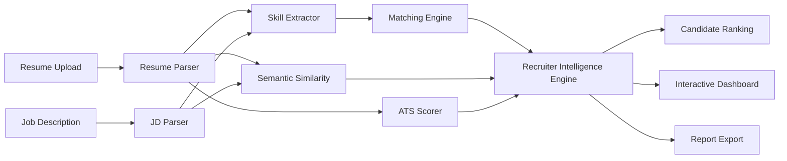

# 🎯 TalentMatch AI

<p align="center">


</p>

> **An end-to-end AI-powered Recruitment Intelligence Platform that automates resume screening, ATS compatibility analysis, semantic candidate matching, recruiter insights, and candidate ranking.**

---

## 🚀 Live Demo

**Live Application**

Coming Soon

```
https://your-streamlit-url.streamlit.app
```

---

## 📌 Why TalentMatch AI?

Modern recruiters receive hundreds of resumes for every technical position.

Manual screening is:

- Time-consuming
- Inconsistent
- Difficult to scale
- Unable to explain why candidates are rejected

TalentMatch AI demonstrates how modern NLP and AI techniques can automate early-stage recruitment using semantic similarity, ATS-inspired analysis, explainable scoring, and recruiter-friendly insights.

This project was built as a **production-quality portfolio project**, focusing on software engineering practices, modular architecture, and practical AI application rather than model experimentation alone.

---

# ✨ Key Features

## 📄 Resume Processing

- Resume Parsing (PDF, DOCX, TXT)
- Job Description Parsing
- Resume Information Extraction
- Candidate Profile Generation
- Experience Detection
- Project Detection

---

## 🤖 AI Matching Engine

- Skill Extraction
- Skill Normalization
- Alias Matching

Examples:

```
FastAPI == fast api

NLP == Natural Language Processing

NumPy == numpy

scikit-learn == sklearn
```

- Hybrid Semantic Similarity
- Resume-to-JD Matching
- Explainable Score Breakdown

---

## 📊 ATS Analysis

- ATS Compatibility Score
- ATS Checklist
- Missing Keywords Detection
- Resume Structure Validation
- Resume Improvement Suggestions

---

## 👨‍💼 Recruiter Intelligence

- Recruiter Summary
- Candidate Recommendation
- Best Fit Roles
- Candidate Level Estimation
- Candidate Ranking
- Explainable AI Feedback

---

## 📈 Visualization

Interactive Plotly dashboards including:

- Overall Score
- Score Breakdown
- Skill Coverage
- ATS Score
- Candidate Ranking

---

## 📥 Export

Generate recruiter-ready reports in:

- JSON
- HTML
- PDF

---

# 🧠 AI Components

TalentMatch AI combines multiple AI and NLP techniques.

| Component | Technology |
|-----------|------------|
| Resume Parsing | pdfplumber, PyMuPDF, python-docx |
| Skill Matching | JSON Skill Ontology |
| Semantic Similarity | Sentence Transformers |
| Embeddings | all-MiniLM-L6-v2 |
| Similarity Metric | Cosine Similarity |
| ATS Scoring | Explainable Rule-Based Engine |
| Recruiter Feedback | Gemini / OpenAI (Optional) |
| Visualization | Plotly |
| Backend | FastAPI |
| Frontend | Streamlit |

---

# 🏗 Architecture



---

# 📸 Application Preview

## Landing Page

```
assets/screenshots/landing.png
```

---

## Resume Analysis Dashboard

```
assets/screenshots/dashboard.png
```

---

## Candidate Ranking

```
assets/screenshots/candidate_ranking.png
```

---

# ⚙ Technology Stack

## Frontend

- Streamlit
- Plotly

---

## Backend

- FastAPI
- Uvicorn

---

## AI / NLP

- Sentence Transformers
- Transformers
- PyTorch
- scikit-learn

---

## Document Processing

- pdfplumber
- PyPDF2
- PyMuPDF
- python-docx

---

## LLM Integration

(Optional)

- Google Gemini
- OpenAI GPT

The application remains fully functional without API keys using a rule-based fallback engine.

---

## Reports

- JSON
- HTML
- ReportLab PDF

---

## Testing

- Pytest
- 27 Automated Tests

---

## Deployment

- Streamlit Community Cloud
- Docker
- Docker Compose

# 🚀 Installation

Clone the repository:

```bash
git clone https://github.com/yourusername/TalentMatch-AI.git
cd TalentMatch-AI
```

---

## Create Virtual Environment

### macOS / Linux

```bash
python3.11 -m venv .venv
source .venv/bin/activate
```

### Windows

```powershell
python -m venv .venv
.venv\Scripts\activate
```

---

## Install Dependencies

```bash
pip install -r requirements.txt
```

---

# ▶ Running the Application

## Streamlit Frontend

```bash
streamlit run frontend/streamlit_app.py
```

Open:

```text
http://localhost:8501
```

---

## FastAPI Backend

```bash
uvicorn app.main:app --reload
```

Open API Documentation:

```text
http://127.0.0.1:8000/docs
```

---

# 🧪 Running Tests

TalentMatch AI includes automated unit tests.

Run:

```bash
pytest
```

Current Status:

```
27 Tests Passing
```

The test suite covers:

- Resume Parsing
- Skill Extraction
- Matching Engine
- Semantic Similarity
- ATS Scoring
- Candidate Ranking

---

# 🐳 Docker Deployment

Build and run:

```bash
docker compose up --build
```

Open:

```text
http://localhost:8501
```

---

# 🚀 Demo Mode

The application includes a built-in **Try Demo** feature.

It automatically loads anonymized sample files and performs a complete analysis without requiring manual uploads.

Sample files:

```text
data/
│
├── sample_resumes/
│     └── sample_resume.txt
│
├── sample_job_descriptions/
│     └── sample_ai_engineer_jd.txt
```

These files contain synthetic candidate information and are safe for public repositories.

---

# 📂 Project Structure

```text
TalentMatch-AI/
│
├── app/
│   ├── api/
│   ├── models/
│   ├── services/
│   ├── utils/
│   ├── config.py
│   └── main.py
│
├── frontend/
│   ├── streamlit_app.py
│   └── Dockerfile
│
├── data/
│   ├── sample_resumes/
│   ├── sample_job_descriptions/
│   └── skills_database/
│
├── assets/
│   ├── screenshots/
│   └── architecture.png
│
├── outputs/
├── tests/
│
├── docker-compose.yml
├── requirements.txt
├── pytest.ini
├── README.md
└── .gitignore
```

---

# 🔑 Environment Variables

LLM-based recruiter feedback is **optional**.

Without API keys, TalentMatch AI automatically uses a deterministic rule-based feedback engine.

Example:

```env
OPENAI_API_KEY=your_openai_key

GEMINI_API_KEY=your_gemini_key

DEFAULT_LLM_PROVIDER=gemini
```

Never commit:

- `.env`
- API Keys
- Personal resumes
- Temporary uploads

---

# ☁ Deployment

TalentMatch AI is ready for deployment on:

- Streamlit Community Cloud
- Docker
- Render
- Railway

### Streamlit Community Cloud

1. Push repository to GitHub.

2. Create a new Streamlit app.

3. Select repository.

4. Main file:

```text
frontend/streamlit_app.py
```

5. (Optional) Add:

```
OPENAI_API_KEY

GEMINI_API_KEY
```

6. Deploy.

---

# ⚡ Performance

Typical execution times:

| Task | Time |
|------|------|
| Resume Parsing | < 1 second |
| Skill Extraction | < 1 second |
| Semantic Matching | 1–3 seconds* |
| ATS Analysis | < 1 second |
| Candidate Ranking | Depends on number of resumes |

*The first run may take longer because the Sentence Transformer model is downloaded and cached locally.

---

# 📈 Example Workflow

```text
Resume Upload
        │
        ▼
Resume Parser
        │
        ▼
Skill Extraction
        │
        ▼
Semantic Similarity
        │
        ▼
ATS Analysis
        │
        ▼
Recruiter Intelligence
        │
        ▼
Interactive Dashboard
        │
        ▼
Report Export
```

---

# 💡 Why This Project?

TalentMatch AI demonstrates practical AI engineering rather than isolated machine learning experiments.

It showcases:

- NLP pipelines
- Semantic search
- Transformer embeddings
- Explainable AI
- ATS-inspired evaluation
- Production-oriented backend design
- Modern Streamlit dashboards
- FastAPI integration
- Docker deployment
- Automated testing

The project is designed to resemble a lightweight HR-tech platform that recruiters and hiring teams can interact with directly.

---

# ⚠ Limitations

Current limitations include:

- Resume parsing is optimized for common layouts and may require tuning for highly customized designs.
- ATS scoring is an explainable approximation and not a replacement for commercial ATS platforms.
- PDF reports currently contain recruiter-ready summaries but do not embed interactive Plotly charts.
- LLM-generated recruiter feedback requires optional API keys; otherwise, a rule-based fallback is used.

---

# 🚀 Future Enhancements

Planned improvements include:

- Live deployed demo
- Authentication and recruiter workspaces
- Resume history and analytics
- Candidate database integration
- Cloud storage support
- Multi-language resume parsing
- CI/CD pipeline with GitHub Actions
- Advanced seniority estimation
- Richer job role taxonomy
- Batch report generation
- Resume version comparison
- RAG-powered recruiter assistant

---

# 🤝 Contributing

Contributions, suggestions, and improvements are welcome.

If you would like to contribute:

1. Fork the repository.
2. Create a feature branch.
3. Commit your changes.
4. Submit a Pull Request.

---

# 📜 License

This project is licensed under the **MIT License**.

See the `LICENSE` file for details.

---

# 👨‍💻 Author

**Muhammad Saad**

MS Data Science  
FAST – National University of Computer and Emerging Sciences (FAST-NUCES), Islamabad

- GitHub: https://github.com/yourusername
- LinkedIn: https://linkedin.com/in/yourprofile

---

# ⭐ Support

If you found this project useful, consider giving it a **⭐ Star** on GitHub.

Feedback, suggestions, and contributions are always appreciated.