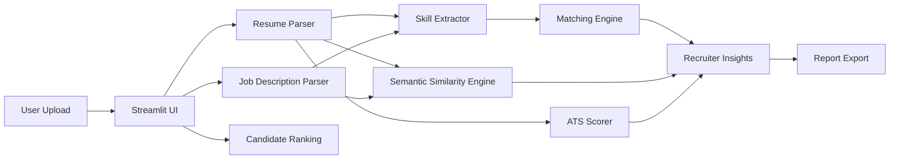

# TalentMatch AI Architecture

```mermaid
flowchart LR
    A[User Upload] --> B[Streamlit UI]
    B --> C[Resume Parser]
    B --> D[Job Description Parser]
    C --> E[Skill Extractor]
    D --> E
    E --> F[Matching Engine]
    C --> G[Semantic Similarity Engine]
    D --> G
    C --> H[ATS Scorer]
    F --> I[Recruiter Insights]
    G --> I
    H --> I
    I --> J[Report Export]
    B --> K[Candidate Ranking]
```
